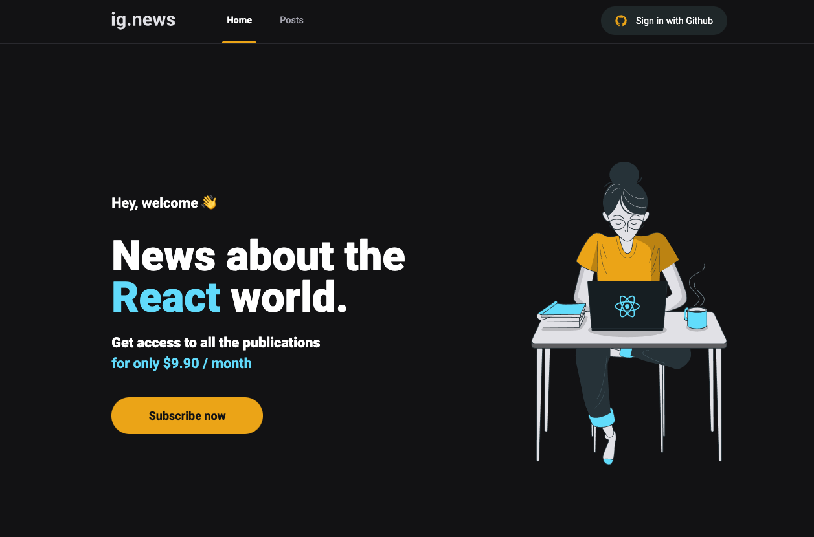
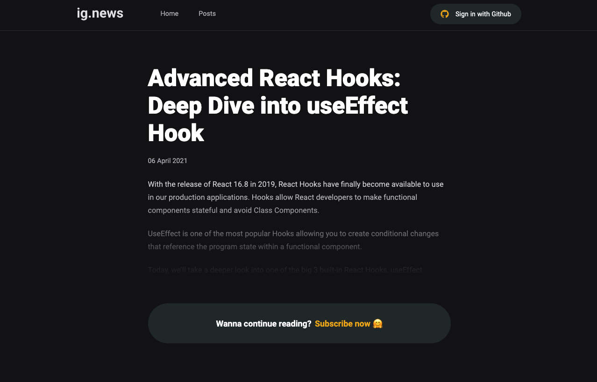
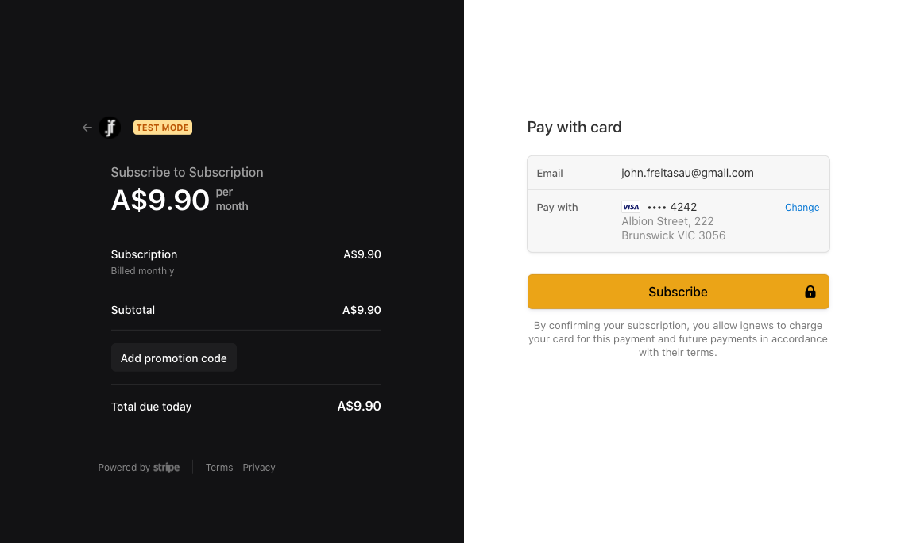
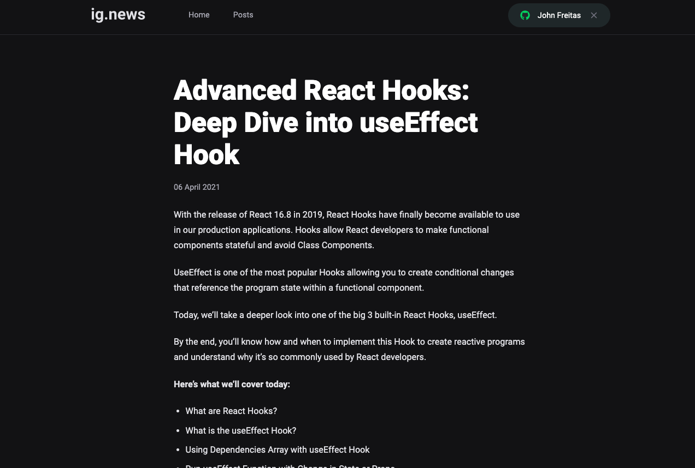

<h1 align="center">
	ig.news
</h1>

<h3 align="center">An awesome paid Blog Model, using Next.js, Prismic CMS and Stripe as payment method</h3>

<!-- <p align="center">An awesome paid Blog Model, using Next.js, Prismic CMS and Stripe as payment method.</p> -->

<p align="center">
  

  <a href="https://www.linkedin.com/in/johnfreitasau/">
    
  </a>

  

  <a href="https://github.com/johnfreitasau/ignews/blob/main/LICENSE">
    
  </a>
</p>

<p align="center">
  
  
</p>

<details>
<summary>Click here to see more images...</summary>

<p align="center">
  
  
  
</p>

</details>  


<p align="center">
  <a href="#rocket-technologies">Technologies</a>&nbsp;&nbsp;&nbsp;|&nbsp;&nbsp;&nbsp;
  <a href="#-getting-started">Getting started</a>&nbsp;&nbsp;&nbsp;|&nbsp;&nbsp;&nbsp;
  <a href="#-how-to-contribute">How to contribute</a>&nbsp;&nbsp;&nbsp;|&nbsp;&nbsp;&nbsp;
  <a href="#closed_book-license">License</a>
</p>


## :rocket: Technologies

* [React JS](https://reactjs.org/)
* [TypeScript](https://www.typescriptlang.org/)
* [Next.js](https://nextjs.org/learn/basics/create-nextjs-app)
* [Stripe](https://stripe.com/docs)
* [Fauna DB](https://docs.fauna.com/fauna/current/start/index.html)
* [Prismic](https://prismic.io/docs)
* [Axios](https://github.com/axios/axios)
* [React Icons](https://react-icons.github.io/react-icons/)
* [SASS](https://sass-lang.com/)


## 💻 Getting started

**Clone the project and access the folder**

```bash
$ git clone https://github.com/johnfreitasau/ignews.git && cd ignews
```

**Follow the steps below**

```bash
# Install the dependencies
$ yarn

# Copy a .env file
$ cp .env.example .env.local

# Be sure the env file have the right keys

# Start project on development mode
$ yarn dev
```

## 🤔 How to contribute?
**Make a fork of this repository**

```bash
# Fork using GitHub official command line
# If you don't have the GitHub CLI, use the web site to do that.

$ gh repo fork johnfreitasau/ignews
```

**Follow the steps below**

```bash
# Clone your fork
$ git clone your-fork-url && cd ignews

# Create a branch with your feature
$ git checkout -b my-feature

# Make the commit with your changes
$ git commit -m 'feat: My new feature'

# Send the code to your remote branch
$ git push origin my-feature
```

After your pull request is merged, you can delete your branch

## :closed_book: License

This project is licensed under the MIT License - see the [LICENSE](LICENSE) file for details.

---

Made with :purple_heart:&nbsp; by John Freitas 👋 
